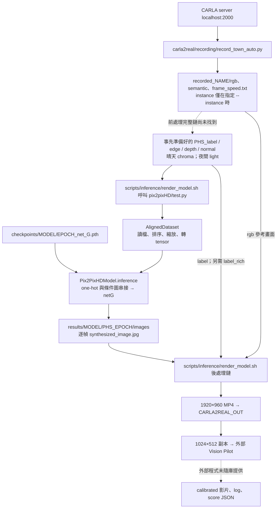
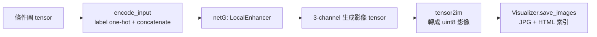

# 推論流程盤點

盤點日期：2026-09-14。範圍：目前 checkout 的靜態程式碼；未執行模型、CARLA 或後處理。實線表示程式中可追蹤的資料流，不代表已在此環境成功執行；虛線表示來源未接通或外部依賴。README 宣告的 baseline 與目前程式碼分開看待。

## 1. 整體架構

這是離線逐幀推論：模型讀取磁碟條件圖，不直接訂閱 CARLA。錄製的 RGB 在此入口不作為完整 RGB tensor 直接送入 Generator；它另供後處理與參考檢查使用。條件圖是否、如何由 RGB 衍生，須補齊前處理證據。

## 2. 路徑與命名

依 `scripts/inference/render_model.sh`，定義：

- `ROOT = CARLA2REAL_ROOT`，預設為專案根目錄。
- `DATA_RENDER = ROOT/datasets`。**此腳本直接指定這個路徑，沒有使用 CARLA2REAL_DATA。**
- `OUT = CARLA2REAL_OUT`，預設 `ROOT/output`。
- `MODEL`、`TAG`、`Town` 由呼叫者指定；`EPOCH` 預設 `latest`。
- 晴天 `NAME=Town05_sunny_inst`、`PHS=test_Town05_sunny_inst_gt`；夜間改為 `night_inst`。
- `DRR = DATA_RENDER/training_v12_mapillary`。名稱雖含 training，推論讀的是其中 `test_*` 目錄。

入口格式：`bash scripts/inference/render_model.sh <sunny|night> <MODEL> <TAG> <Town...>`。這是介面說明，不是已驗證可執行的命令。

## 3. 模型輸入

下表是預設 render 入口開啟的條件；不是所有實驗變體的總表。

| 輸入 | 讀取位置 | 讀取／模型處理 | 產生來源確認程度 |
|---|---|---|---|
| 語意 label | `DRR/PHS_label/` | 類別 ID 圖 → 65-channel one-hot | 當前 65 類前處理鏈未找到 |
| edge | `DRR/PHS_edge/` | 灰階，1 channel，0–1 | 目前推論資料的生成與 instance 合併流程未確認 |
| depth | `DRR/PHS_depth/` | 灰階，1 channel，0–1 | 文件提及 MoGe；實際推論生成程式未提供 |
| normal | `DRR/PHS_normal/` | RGB 編碼，3 channels，0–1 | 文件提及 MoGe；實際推論生成程式未提供 |
| chroma，晴天 | `DRR/PHS_chroma/` | RGB 編碼，3 channels，0–1 | 推論端生成流程未確認 |
| light，夜間 | `DRR/PHS_light/` | 灰階，1 channel，0–1 | 推論端生成流程未確認 |
| Generator 權重 | `ROOT/pix2pixHD/checkpoints/MODEL/EPOCH_net_G.pth` | 建立網路後載入 | 本 checkout 沒有 checkpoints 資料夾 |

`aligned_dataset.py` 對每個資料夾分別排序後按相同 index 取檔，並非按檔名 join。`test.py` 固定 batch=1、無 shuffle、無 flip；render 指定寬度 2048、等比例縮放。原圖若是 2:1，模型處理尺寸為 2048×1024；不能在沒有實際資料時保證所有輸入比例。

預設晴天輸入共有 73 channels，夜間 71 channels。實際串接順序為 label → edge → depth → light（夜）／chroma（日）→ normal。入口有 `--no_instance`，不另外讀 `PHS_inst`；`n_weather_classes` 預設 0，不加 weather one-hot。

## 4. 模型內部與逐幀輸出

呼叫鏈：`test.py` → `CreateDataLoader` → `AlignedDataset`；`create_model` → `InferenceModel` → `Pix2PixHDModel.inference` → `netG.forward`。`netG=local` 在 `networks.py` 選用 LocalEnhancer，包含較低解析度的 GlobalGenerator 與局部增強路徑。此模型生成步驟使用 Generator；Discriminator 不參與這條推論路徑。

輸出目錄：`ROOT/pix2pixHD/results/MODEL/PHS_EPOCH/`。

- `images/<輸入檔名主體>_synthesized_image.jpg`：生成畫面。
- `images/<輸入檔名主體>_input_label.jpg`：label 視覺化。
- `index.html`：瀏覽索引。

可選分支：`TEMPORAL=1` 會增加前一張生成圖作為輸入，首幀用全零 tensor，之後逐幀回饋。此分支需要對應權重，不能視為 v75/v76 已啟用的設定。另有 multiframe 程式支援，但此 render 入口未傳入啟用參數。

## 5. 後處理與交付

`B = ROOT/pix2pixHD/results/mp4/vision_pilot/<town小寫>/<town小寫>_<weather>_<TAG>`。

| 順序 | 處理程式 | 輸入 → 輸出 |
|---|---|---|
| 0 | `carla2real/validation/check_reference.py` | 生成圖 + 錄製 RGB；檢查參考畫面是否對應 |
| 1 | `carla2real/postprocessing/stabilize_frames_v2.py` | 生成 JPG → `B_baseline.avi` |
| 2，可跳過 | 外部 `dvp_pytorch/main_IRT.py` | 錄製 RGB + 原始生成 JPG 副本 → 暫存 DVP frames |
| 3 | `carla2real/postprocessing/make_v33.py` | baseline + DVP frames → `B_v33_sunny.mp4`、`B_v33_sharp.mp4`；但呼叫端找 `.avi`，見 Q4 |
| 4 | `carla2real/postprocessing/photoreal_post.py` | 選定影片 → `B_photoreal.avi` |
| 5，僅夜間 | `carla2real/postprocessing/protect_light_pools.py` | 影片 + RGB + label → `B_pools.avi` |
| 6 | `carla2real/postprocessing/protect_lane_markings.py` | 影片 + RGB + label → `B_lane.avi` |
| 7 | `carla2real/postprocessing/protect_billboards.py` | 影片 + RGB + **label_rich** → `B_bb.avi` |
| 8 | `carla2real/postprocessing/protect_traffic_lights_carla.py` | 影片 + RGB + label → `B_FINAL.avi` |
| 9 | 腳本內嵌 OpenCV | 選定影片 → `B_FINAL_1920.mp4`，1920×960 |

`NO_TEMPORAL_POST=1` 會略過 DVP，並將穩定化腳本 alpha 設為 0。DVP 使用的是原始生成 JPG 副本，不是 baseline 影片。部分後處理產物不存在時，呼叫端回退到前一階段，因此不能僅憑 FINAL 檔名判定每個階段成功。腳本末端刪除多個中間影片與 DVP 暫存。

交付檔名 `DN=<town小寫>_<weather>_vp55_<TAG>_FINAL_1920_visionpilot.mp4`：

- `OUT/DN`：1920×960 生成影片；雖有 visionpilot 字樣，此檔本身不是 HUD 疊圖版。
- `OUT/vp_input_1024/DN`：1024×512 副本，供外部感知程式。
- `OUT/<town小寫>_<weather>_frame_speed.txt`：若 recording 有速度檔則複製。
- 外部 `PERCEPTION_ROOT/build/record_carla.sh` 被要求寫入 `OUT/calibrated/DN` 及 `OUT/logs_TAG/<town>_<weather>.log`；外部實作未提供。
- 若 `OUT/gt/<town>_<weather>_gt.json` 存在，呼叫 `carla2real/evaluation/score_vp.py` 產生同 log 目錄下的 `*_score.json`。
- `scripts/delivery/refresh_new.sh` 再把支援的 town 整理到 `ROOT/pix2pixHD/results/mp4/NEW/<TAG>/town<N>/<weather>/`，優先建立 hard link，失敗才複製。

## 6. 待釐清議題

| ID | 已觀察到的事實 | 待釐清事項 |
|---|---|---|
| Q1 | README 宣告 sunny v75、night v76；checkout 沒有權重及實際推論條件圖 | 取得目前實際使用的命令、程式版本、權重與範例資料後才能確認部署流程 |
| Q2 | `carla2real/preprocessing/legacy/prepare_gt_test_label.py` 固定讀 `recorded_Town03/semantic`，寫 `training_semantic_v6/test_Town03_gt_label`，採 Cityscapes-19；render 要求另一位置的 65 類圖 | 目前 65 類 label 與 label_rich 如何產生？不能把這支舊程式直接接到主圖 |
| Q3 | README 用 `TEXTURE=1`；render 沒讀這個變數，Dataset、test.py、Generator 沒有 texture 輸入串接；`make_v50r.sh` 也不存在 | 補回 v75 texture 支援及晴天 delivery chain 的正確版本；現有 `carla2real/preprocessing/gen_texture_energy.py` 不代表整條已接通 |
| Q4 | `carla2real/postprocessing/make_v33.py` 寫 `.mp4`，render 檢查 `.avi`，乾淨輸出下會繼續使用 baseline | 原本要使用哪個 DVP 輸出？目前實際交付是否包含 DVP 結果？ |
| Q5 | MoGe、edge、chroma 等生成腳本在 staging 中被引用但未隨庫提供；DVP 目錄也缺少 | 補足推論端前處理程式、依賴版本、呼叫參數與順序；訓練 staging 不能當成推論端證據 |
| Q6 | recording 存前三個 BGRA 通道；舊 label 轉換按色票比對；render 僅檢查通道檔案數量下限 | 釐清每階段 RGB/BGR 與 semantic 編碼契約，以及檔名、幀序是否完全對齊 |
| Q7 | recorder 用 CARLA2REAL_DATA，render 硬編 ROOT/datasets；render 也固定 conda 環境 carla_env | 實際資料路徑與環境設定為何？自訂環境變數時兩端未必一致 |
| Q8 | README 說感知評分可選，render 卻無條件嘗試進入 PERCEPTION_ROOT/build | 未設定外部 stack 的預期行為、需不需要真正的略過開關 |

本次只記錄，未修正上述問題。優先補 Q1–Q3，再釐清前處理與後處理契約。

## 7. 程式碼依據

- `scripts/inference/render_model.sh`：入口參數、檔案路徑、架構旗標、後處理順序及交付。
- `carla2real/recording/record_town_auto.py`：錄製輸出；`carla2real/preprocessing/legacy/prepare_gt_test_label.py`：舊 19 類轉換。
- `pix2pixHD/test.py`、`data/aligned_dataset.py`、`data/base_dataset.py`：載入、縮放與逐幀推論。
- `pix2pixHD/models/{models,pix2pixHD_model,base_model,networks}.py`：模型建立、權重載入與生成。
- `pix2pixHD/util/{util,visualizer}.py`：生成結果轉圖與儲存。
- `carla2real/postprocessing/make_v33.py`、`scripts/delivery/refresh_new.sh`：輸出副檔名與交付整理。
- `README.md`：baseline 宣告；其與程式碼的差異見 Q1–Q3。
