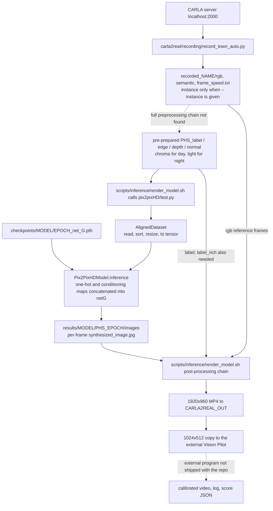
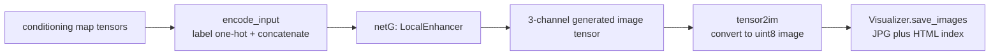

# Inference flow audit

Audited 2026-09-14. Scope: the static code in the checkout at that time. No model, CARLA instance
or post-processing was executed. Solid lines are data flows traceable in the code; they do not mean
the path has been run successfully in this environment. Dashed lines mean the source is not wired
up or is an external dependency. The baselines the README declares are treated separately from what
the code shows.

> English translation of `docs/zh/INFERENCE_FLOW.zh.md`, which remains the original.
>
> **Dated 2026-09-14 and partly superseded.** The baselines are now v85d (sunny) and v79 (night);
> Q1 and Q3 below have since been addressed in the working tree. The open questions are kept as
> written because the audit is what makes them traceable.

## 1. Overall architecture

This is offline per-frame inference: the model reads conditioning maps from disk and does not
subscribe to CARLA directly. The recorded RGB is not fed into the generator as a full RGB tensor at
this entry point; it is used by post-processing and for reference checks. Whether and how the
conditioning maps are derived from RGB still needs preprocessing evidence.

## 2. Paths and naming

As defined in `scripts/inference/render_model.sh`:

- `ROOT = CARLA2REAL_ROOT`, defaulting to the project root.
- `DATA_RENDER = ROOT/datasets`. **This script sets that path directly and does not use
  `CARLA2REAL_DATA`.**
- `OUT = CARLA2REAL_OUT`, defaulting to `ROOT/output`.
- `MODEL`, `TAG` and `Town` are given by the caller; `EPOCH` defaults to `latest`.
- Sunny: `NAME=Town05_sunny_inst`, `PHS=test_Town05_sunny_inst_gt`. Night uses `night_inst`.
- `DRR = DATA_RENDER/training_v12_mapillary`. Despite "training" in the name, inference reads the
  `test_*` directories inside it.

Entry point: `bash scripts/inference/render_model.sh <sunny|night> <MODEL> <TAG> <Town...>`. That is
an interface description, not a command verified to run.

## 3. Model inputs

The table below lists the conditions the default render entry point enables; it is not a complete
table of every experimental variant.

| Input | Read from | Read / model handling | Confidence in how it is produced |
|---|---|---|---|
| semantic label | `DRR/PHS_label/` | class-ID map → 65-channel one-hot | the current 65-class preprocessing chain was not found |
| edge | `DRR/PHS_edge/` | greyscale, 1 channel, 0–1 | generation and instance-merge flow for the current inference data unconfirmed |
| depth | `DRR/PHS_depth/` | greyscale, 1 channel, 0–1 | documents mention MoGe; the actual inference-side generator is not provided |
| normal | `DRR/PHS_normal/` | RGB-encoded, 3 channels, 0–1 | documents mention MoGe; the actual inference-side generator is not provided |
| chroma (sunny) | `DRR/PHS_chroma/` | RGB-encoded, 3 channels, 0–1 | inference-side generation flow unconfirmed |
| light (night) | `DRR/PHS_light/` | greyscale, 1 channel, 0–1 | inference-side generation flow unconfirmed |
| generator weights | `ROOT/pix2pixHD/checkpoints/MODEL/EPOCH_net_G.pth` | loaded after the network is built | this checkout has no checkpoints directory |

`aligned_dataset.py` sorts each directory separately and takes files by the same index; it does not
join on filename. `test.py` fixes batch=1 with no shuffle and no flip; render specifies width 2048
with proportional scaling. If the source is 2:1, the model processes 2048×1024 — without real data
present, no guarantee can be made about every input's aspect ratio.

The default sunny input is **73 channels** and night is **71**. The concatenation order is
label → edge → depth → light (night) / chroma (day) → normal. The entry point passes
`--no_instance`, so `PHS_inst` is not read, and `n_weather_classes` defaults to 0, so no weather
one-hot is appended.

## 4. Inside the model, and per-frame output

Call chain: `test.py` → `CreateDataLoader` → `AlignedDataset`; `create_model` → `InferenceModel` →
`Pix2PixHDModel.inference` → `netG.forward`. With `netG=local`, `networks.py` selects LocalEnhancer,
which contains a lower-resolution GlobalGenerator plus a local enhancement path. Only the generator
is used in this path; the discriminator takes no part in inference.

Output directory: `ROOT/pix2pixHD/results/MODEL/PHS_EPOCH/`

- `images/<input stem>_synthesized_image.jpg` — the generated frame
- `images/<input stem>_input_label.jpg` — label visualisation
- `index.html` — browsing index

Optional branch: `TEMPORAL=1` adds the previously generated frame as an input, using an all-zero
tensor for the first frame and feeding back per frame after that. It requires matching weights and
must not be assumed to be enabled for v75/v76. Multiframe support also exists in the code, but this
render entry point passes no parameter to enable it.

## 5. Post-processing and delivery

`B = ROOT/pix2pixHD/results/mp4/vision_pilot/<town lowercase>/<town lowercase>_<weather>_<TAG>`

| Order | Program | Input → output |
|---|---|---|
| 0 | `carla2real/validation/check_reference.py` | generated frames + recorded RGB; checks the reference frames correspond |
| 1 | `carla2real/postprocessing/stabilize_frames_v2.py` | generated JPGs → `B_baseline.avi` |
| 2, skippable | external `dvp_pytorch/main_IRT.py` | recorded RGB + a copy of the raw generated JPGs → temporary DVP frames |
| 3 | `carla2real/postprocessing/make_v33.py` | baseline + DVP frames → `B_v33_sunny.mp4`, `B_v33_sharp.mp4` — but the caller looks for `.avi`, see Q4 |
| 4 | `carla2real/postprocessing/photoreal_post.py` | selected video → `B_photoreal.avi` |
| 5, night only | `carla2real/postprocessing/protect_light_pools.py` | video + RGB + label → `B_pools.avi` |
| 6 | `carla2real/postprocessing/protect_lane_markings.py` | video + RGB + label → `B_lane.avi` |
| 7 | `carla2real/postprocessing/protect_billboards.py` | video + RGB + **label_rich** → `B_bb.avi` |
| 8 | `carla2real/postprocessing/protect_traffic_lights_carla.py` | video + RGB + label → `B_FINAL.avi` |
| 9 | inline OpenCV in the script | selected video → `B_FINAL_1920.mp4`, 1920×960 |

`NO_TEMPORAL_POST=1` skips DVP and sets the stabilisation script's alpha to 0. DVP consumes a copy
of the raw generated JPGs, not the baseline video. When a post-processing output is missing, the
caller falls back to the previous stage — so the presence of a FINAL file is **not** evidence that
every stage succeeded. The end of the script deletes several intermediate videos and the DVP
temporaries.

Delivered filename `DN=<town lowercase>_<weather>_vp55_<TAG>_FINAL_1920_visionpilot.mp4`:

- `OUT/DN` — the 1920×960 generated video. Despite the `visionpilot` in the name, this file is not
  the HUD-overlaid version.
- `OUT/vp_input_1024/DN` — a 1024×512 copy for the external perception program.
- `OUT/<town lowercase>_<weather>_frame_speed.txt` — copied if the recording has a speed file.
- The external `PERCEPTION_ROOT/build/record_carla.sh` is expected to write `OUT/calibrated/DN` and
  `OUT/logs_TAG/<town>_<weather>.log`. That external implementation is not provided.
- If `OUT/gt/<town>_<weather>_gt.json` exists, `carla2real/evaluation/score_vp.py` is called and
  writes `*_score.json` into the same log directory.
- `scripts/delivery/refresh_new.sh` then collects the supported towns into
  `ROOT/pix2pixHD/results/mp4/NEW/<TAG>/town<N>/<weather>/`, preferring hard links and copying only
  if that fails.

## 6. Open questions

| ID | Observed fact | To be clarified |
|---|---|---|
| Q1 | The README declares sunny v75 and night v76; the checkout has neither the weights nor real inference conditioning maps | The deployment flow can only be confirmed once the actual commands, code version, weights and sample data in use are obtained |
| Q2 | `carla2real/preprocessing/legacy/prepare_gt_test_label.py` reads a fixed `recorded_Town03/semantic`, writes `training_semantic_v6/test_Town03_gt_label`, and uses Cityscapes-19; render expects 65-class maps in a different location | How are the current 65-class label and label_rich produced? This legacy program cannot be connected to the main diagram as-is |
| Q3 | The README uses `TEXTURE=1`; render does not read that variable, and there is no texture input wired through Dataset, test.py or the generator. `make_v50r.sh` is also absent | Restore v75 texture support and the correct version of the sunny delivery chain. The presence of `carla2real/preprocessing/gen_texture_energy.py` does not mean the whole path is connected |
| Q4 | `carla2real/postprocessing/make_v33.py` writes `.mp4` while render checks for `.avi`, so on a clean run it keeps using baseline | Which DVP output was intended? Does the current delivery actually include DVP results? |
| Q5 | MoGe, edge and chroma generation scripts are referenced in staging but not shipped with the repo; the DVP directory is also missing | Supply the inference-side preprocessing programs, dependency versions, call parameters and ordering. Training staging is not evidence for the inference side |
| Q6 | Recording stores the first three BGRA channels; the legacy label conversion matches on a colour table; render only checks a minimum channel file count | Clarify the RGB/BGR and semantic encoding contract at each stage, and whether filenames and frame ordering align exactly |
| Q7 | The recorder uses `CARLA2REAL_DATA` while render hard-codes `ROOT/datasets`; render also pins the conda environment `carla_env` | What are the actual data paths and environment settings? The two ends do not necessarily agree when environment variables are customised |
| Q8 | The README says perception scoring is optional, yet render unconditionally tries to enter `PERCEPTION_ROOT/build` | Define the expected behaviour when the external stack is not configured, and whether a real skip switch is needed |

This audit records the above; it does not fix them. Q1–Q3 are the priority, followed by clarifying
the preprocessing and post-processing contracts.

## 7. Code this is based on

- `scripts/inference/render_model.sh` — entry parameters, file paths, architecture flags,
  post-processing order and delivery.
- `carla2real/recording/record_town_auto.py` — recording output;
  `carla2real/preprocessing/legacy/prepare_gt_test_label.py` — the legacy 19-class conversion.
- `pix2pixHD/test.py`, `data/aligned_dataset.py`, `data/base_dataset.py` — loading, scaling and
  per-frame inference.
- `pix2pixHD/models/{models,pix2pixHD_model,base_model,networks}.py` — model construction, weight
  loading and generation.
- `pix2pixHD/util/{util,visualizer}.py` — converting and saving generated results.
- `carla2real/postprocessing/make_v33.py`, `scripts/delivery/refresh_new.sh` — output file
  extensions and delivery collection.
- `README.md` — the baseline declarations; the differences from the code are Q1–Q3.
